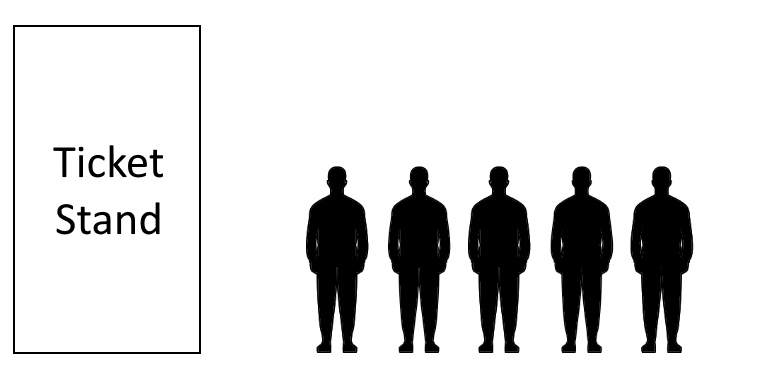
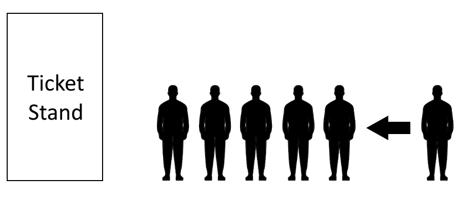
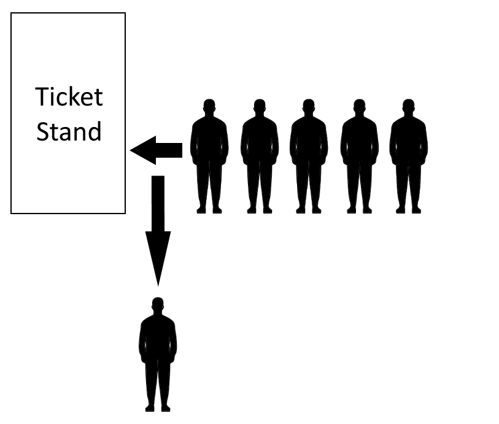

# Queues

* [Welcome](0-welcome.md)
* [Introduction](https://github.com/LagazoLabs/CSE-212-Final-Project/blob/main/Data%20Structures%20Project/1-topic.md#introduction)
* [Why Queues](https://github.com/LagazoLabs/CSE-212-Final-Project/blob/main/Data%20Structures%20Project/1-topic.md#why-queues-are-used)
* [Creating Queues](https://github.com/LagazoLabs/CSE-212-Final-Project/blob/main/Data%20Structures%20Project/1-topic.md#creating-queues)
* [Enqueing](https://github.com/LagazoLabs/CSE-212-Final-Project/blob/main/Data%20Structures%20Project/1-topic.md#enqueuing-adding-items)
* [Dequeing](https://github.com/LagazoLabs/CSE-212-Final-Project/blob/main/Data%20Structures%20Project/1-topic.md#dequeing-removing-items)
* [Vocabulary](https://github.com/LagazoLabs/CSE-212-Final-Project/blob/main/Data%20Structures%20Project/1-topic.md#vocabularykey-words)
* [Practice](https://github.com/LagazoLabs/CSE-212-Final-Project/blob/main/Data%20Structures%20Project/1-topic.md#practice)

## Introduction
You may not realize it, but you often see queues in your day to day life. That long grocery store checkout line that you waited in? That's a queue! Stuck in the DMV for several hours because of the monotonous proccess that each and every person has to go through? Queues exist in Python as well and can be utilized in a variety of situations.

## Why Queues Are Used
Many may be losing their marbles right now wondering why we can't just use regular arrays like a sane person, well, arrays can be used for simple programs that are not very resource intensive. However for complex programs with hundrends of lines of code, queues can end up being the more optimal choice. Queues won't work for every situation however, they are useful when request need to perform multiple functions or modify data in a set order. This is known as the **FIFO** rule, where the first item in the queue should be the first out item, with the same going for every subsequent item.

Let's futher emphasize the importance and significance of the performance difference between arrays and queues. For large collections of data that need be processed in a orderly way. Let's take the following graph for example


[Source](https://www.bigocheatsheet.com)

Queues are far more efficient than arrays, as the big-O-notation for adding/removing items from arrays is an averge of *o(n)*. However, on the other hand, queues have a big-O-notation of *o(1)*, which, when looking at the graph, is *a lot* quicker. In fact, with a big-O-notation of *o(1)* the size of the queue does not factor into run time anymore! With *o(n)* size will matter because n represents the size, the larger the collection of data and how your program is coded, it can become drastically slower.

## Creating Queues

The following code implements a simple version of a queue.

```Python
class Queue:

    def __init__(self):
        self.queue = []

    def get_queue(self):
        print(self.queue)

    def enqueue(self, value):
        self.queue.append(value)

    def dequeue(self):
        if len(self.queue) <= 0:
            print("The queue is empty.")
            return self.queue
        else:      
            value = self.queue[0] 
            del self.queue[0]
            return value
```

The code utilizes a class and methods to implement the functionality of a queue. As said previously, the **FIFO** rule states how the first item in is the first one out, and the next one in the front is the next one out. To get a ticket to a movie in a traditional sense, you would need to wait in a line.



## Enqueuing (Adding Items)

```Python
def enqueue(self, value):
        self.queue.append(value)
```

Enqueing with this type of queue is rather simple and just requires a simple append method.

Newly enqued items are sent to the back of list, like how any ordinary queue works. If you wanted to get tickets to a movie in the traditonal way, you may need to wait in a line in order to even purchase them. As soon as someone enters the line, that is the process of being enqued. It is important to note that in queues, you start in the back, there is no "cutting." Once again, the **FIFO rule** makes it clear that you can only enter in the *back*.



## Dequeing (Removing Items)

```Python
def dequeue(self):
    if len(self.queue) <= 0:
        print("The queue is empty.")
        return self.queue
    else:    
        value = self.queue[0] 
        del self.queue[0]
        return value
```

The code for dequeing appears to be a little more complicated than enqueing, but not really as we take a closer look. The IF statement simply is used as a means to check if the list used for the queue is empty, because you obviously cannot remove something from a queue that is empty. Enqueuing does not need an if statement because it does not matter, you can enqueue whether the queue is empty or not.

Much like how lines to the movie theater work in real life, after the person is finished purchasing their tickets, they are then dequed from the list and the next person is next.



## Vocabulary/Key Words

Word     | Definition
-------- | --------
FIFO     | The order in which queues are processed through. The oldest is always the next one out, no exceptions.
Enqueuing | The process where an item is added to the back of the queue.
Dequeing | The process where an item is removed from the front of the queue.
o(1)    | The big-O-notation that represents the efficiency of a program, which is constant. Size does not impact efficiency.
o(n)    | The big-O-notation that represents the efficiency of a program, which is linear. Size does impact efficiency.

## Practice

Now that we have covered the basics of queues, how they work, and how to implement them, we should go over some practice to make you understand the fundamentals.

### 1. Movie Theater
Someone created a prototype for an online ticket purchasing program. To ensure it is fair, the system utilizes a queue. However, an error has occured and you are tasked to fix the error.

Problem: [topic1-problem1](code/topic1problem1.py)

Please download the following file, if you cannot figure out the solution within five minutes, please view the solution. 

Solution: [topic1-solution1](code/topic1solution1.py)

### 2. Dictionary Queue 

Using the code examples and your own knowledge about dictionaries, create a sample program. Take around 15 to 30 minute before looking at the following solution.

Solution: [topic1-solution2](code/topic1solution2.py)
