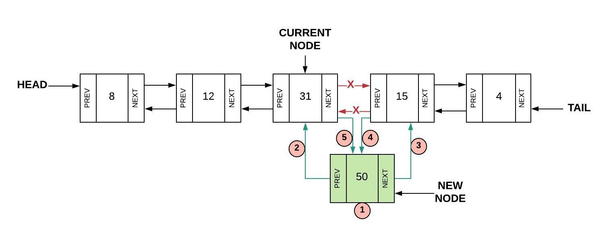
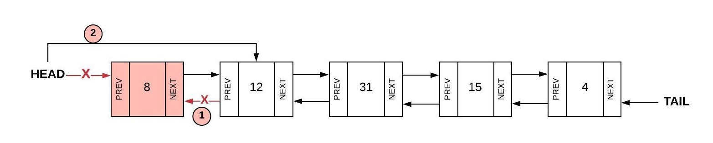

# Linked List

## Introduction
A link list is a data structure that is utilized to organize data. Unlike arrays, values in a linked list are not guranted to be next to eachother. There are **pointers** that will direct the code to the location of the next value. In this case, a location of a value is refered to as a **node**, furthermore, the **node** that is the very first is known as the **head**, while the **node** at the end is refered to as the **tail** (kinda like a snake).

There are two different types of Linked List that we will cover in this section. The first being a standard linked list, one where the **pointers** will only have **pointers** ponting from the **head** to the **tail**, but not back.


On the other hand, there are doubly-linked List, where, unlike standard linked list, doubly-linekd List are able to point in both directions, being able to move forward or backwards through it. 


## Why Linked List Are Used
When thinking whether or not to use an array or a linked list, consider the following:
* The size (or expected size) of the data that you are gonna utilize for the program.
* The overall scope of the program. 
* The complexity of the task that involves the data.

As with [queues](1-topic.md), linked list are used are often utilized in certain scenarions instead of arrays. Linked list have a big-O-notation of o(1) when it comes to insertions and deletions (meaning the size of the linked list will not matter towards performance), while arrays will have a big-O-notation of o(n) (which *will* be dependent on the array size).


[Source](https://www.bigocheatsheet.com)

In addition, the overall scope of the program matters as well if you are trying to decide between linked list and arrays. If the program is just one file with not that mcuh code, you're probably fine without it. However, if the program has many different files all with many lines of code, it might be best to consider a linked list to help with efficiency. 

Lastly, it can also depend on what the program is doing to the data. Is it printing it all out? Is it modifying it? Is it performing math? Are you trying to find a specific value? Are you trying to sort the data in a specific way? Consider the complexity at the task at hand before implementing a linked list.

## Creating Linked List
As stated before, each element, or each **node** will be *linked* together using **pointers.** These pointers will connect and point a program from one node to the next. The first node is often refered to as the head, while the end is the tail.

```Python
class LinkedList:
    class Node:
        def __init__(self, data):
            self.data = data
            self.next = None
            self.prev = None

    def __init__(self):
        self.head = None
        self.tail = None
```

The class will initialize the data, next, and prev. The variables **next** and **prev** are essential in this because they will be representing the **pointers** for the values.

## Adding Items to a Linked List
There are various ways to add items to a linked list, and all it depends is if you are removing from the head/tail, or the middle.


Using the image above, we can see how new values are added in to the head of the linked list.

```Python
    def insert_head(self, value):
        new_node = LinkedList.Node(value) # 1. Creates a new node based off the inputed parameter.   
        
        # Checks if the list is empty.
        if self.head is None:
            # If the list is empty, it will set both the head and tail as the new node.
            self.head = new_node 
            self.tail = new_node
        else:
            # Otherwise, it will...
            new_node.next = self.head # 2. Set the ncurrent head the next value for the new node.
            self.head.prev = new_node # 3. Set the previous value of the current head as the new node.
            self.head = new_node # 4. Set the head as the new node. 
```

Inserting to the tail, is the opposite of inserting to the head.

```Python
    def insert_tail(self, value):
        new_node = LinkedList.Node(value)  
        
        if self.tail is None:
            self.head = new_node
            self.tail = new_node

        else:
            new_node.prev = self.tail 
            self.tail.next = new_node 
            self.tail = new_node
```



Using the image above, we can see how new values are added in the middle of linked list.

```Python
    def insert_middle(self, value, new_value):
        curr = self.head
        
        # This will loop through the linked list, from head to tail.
        while curr is not None:
            if curr.data == value:
                # If we reach the end without finding 'value', it will simply set the new value as the tail.
                if curr == self.tail:
                    self.insert_tail(new_value)
                else:
                    new_node = LinkedList.Node(new_value) # 1. New node being created,
                    new_node.prev = curr # 2. The previous of the new node will be set as the current node. 
                    new_node.next = curr.next # 3. Sets the next value of the new node as the next value of the current node.
                    curr.next.prev = new_node # 4. The previous node, which is next after the current is the new node.
                    curr.next = new_node # 5. The next iem after the current node is now the new node. 
                return
            curr = curr.next
```

## Removing Items from a Linked List
There are various ways to remove items to a linked list, and all it depends is if you are removing from the head/tail, or the middle.

In order insert into the head, we will need to set the current head as none, while the second node becomes the new node...



```Python
    def remove_head(self):
        if self.head == self.tail: # Checks if the list has only one value in it, and will set both head and tail as None.
            self.head = None
            self.tail = None
        elif self.head is not None:
            self.head.next.prev = None # 1. Set's the second node's previous node as nothing.
            self.head = self.head.next # 2. Set's the head to become the next node after the current head. 
```

Much like in "Adding Items to a Linked List" where inserting into the tail is just the opposite of inserting into the head, removing from the tail is also just the opposite of removing from the head.

```Python
    def remove_tail(self):
        
        if self.head == self.tail:
            self.head = None
            self.tail = None

        elif self.tail is not None:
            self.tail.prev.next = None  
            self.tail = self.tail.prev  
```

Likewise, removing from the middile in a linked list is not as simmilar to when you are inserting into a linked list.


```Python
    def remove_middle(self, value):
        curr = self.head
        while curr is not None:
            if curr.data == value:
                if curr == self.head:
                    self.remove_head() # Removes the head if the value is found at the head.
                elif curr == self.tail:
                    self.remove_tail() # Removes the tail if the value is found at the tail.
                else:
                    curr.next.prev = curr.prev # 1
                    curr.prev.next = curr.next # 2    
                return
            else:
                curr = curr.next # Will move the current to the next value in the list if it does not find the value that is going to be removed. 
        
        return
```

## Practice
