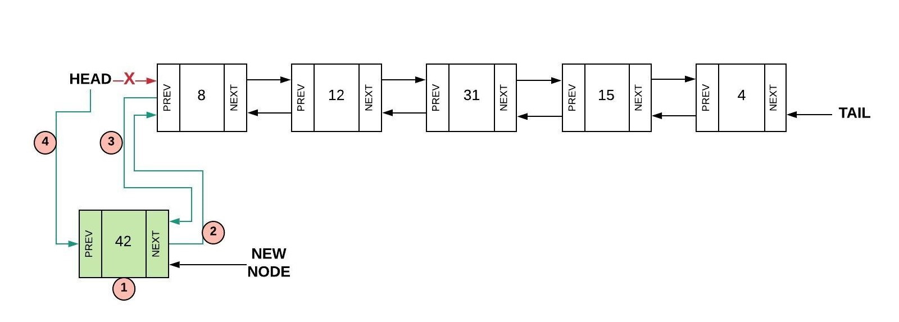

# Linked List

## Introduction
A link list is a data structure that is utilized to organize data. Unlike arrays, values in a linked list are not guranted to be next to eachother. There are **pointers** that will direct the code to the location of the next value. In this case, a location of a value is refered to as a **node**, furthermore, the **node** that is the very first is known as the **head**, while the **node** at the end is refered to as the **tail** (kinda like a snake).

There are two different types of Linked List that we will cover in this section. The first being a standard linked list, one where the **pointers** will only have **pointers** ponting from the **head** to the **tail**, but not back.


On the other hand, there are doubly-linked List, where, unlike standard linked list, doubly-linekd List are able to point in both directions, being able to move forward or backwards through it. 


## Why Linked List Are Used
When thinking whether or not to use an array or a linked list, consider the following:
* The size (or expected size) of the data that you are gonna utilize for the program.
* The overall scope of the program. 
* The complexity of the task that involves the data.

As with [queues](1-topic.md), linked list are used are often utilized in certain scenarions instead of arrays. Linked list have a big-O-notation of o(1) when it comes to insertions and deletions (meaning the size of the linked list will not matter towards performance), while arrays will have a big-O-notation of o(n) (which *will* be dependent on the array size).


[Source](https://www.bigocheatsheet.com)

In addition, the overall scope of the program matters as well if you are trying to decide between linked list and arrays. If the program is just one file with not that mcuh code, you're probably fine without it. However, if the program has many different files all with many lines of code, it might be best to consider a linked list to help with efficiency. 

Lastly, it can also depend on what the program is doing to the data. Is it printing it all out? Is it modifying it? Is it performing math? Are you trying to find a specific value? Are you trying to sort the data in a specific way? Consider the complexity at the task at hand before implementing a linked list.

## Creating Linked List
As stated before, each element, or each **node** will be *linked* together using **pointers.** These pointers will connect and point a program from one node to the next. The first node is often refered to as the head, while the end is the tail.

## Adding Items to a Linked List
There are various ways to add items to a linked list, and all it depends is if you are removing from the head/tail, or the middle.


In this example, we are using a doubly-linked list.

```Python
    def insert_head(self, value):
        new_node = LinkedList.Node(value) # 1. Creates a new node based off the inputed parameter.   
        
        # Checks if the list is empty.
        if self.head is None:
            # If the list is empty, it will set both the head and tail as the new node.
            self.head = new_node 
            self.tail = new_node
        else:
            # Otherwise, it will...
            new_node.next = self.head # 2. Set the ncurrent head the next value for the new node.
            self.head.prev = new_node # 3. Set the previous value of the current head as the new node.
            self.head = new_node # 4. Set the head as the new node. 
```


In order to insert into the middle, the nodes will need to be rearranged. Such as inserting 5 into 1,2,3,4,6,8,10, inserting 5 after 4 will require "5" to be programmed as the new previous of 6, and 4 the new previous of 4, and 5 the new next of 4. 

## Removing Items from a Linked List
There are various ways to remove items to a linked list, and all it depends is if you are removing from the head/tail, or the middle.


In order insert into the head, we will need to set the current head as none, while the second node becomes the new node.


## Practice
