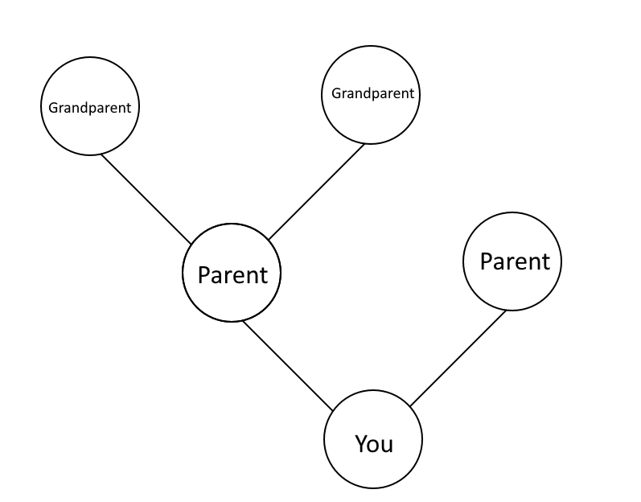
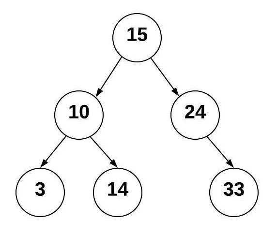

# Binary Search Trees

## Introduction
Binary Search Trees are a complex structure of data. A Binary Search Tree, much like the name implies, structures data into a *tree* like format. Binary Search Trees sort data based off their value. An easy way to have a better understanding of it is if you compare it to family trees.

As you can see, the **Child** is linked to two **Parents**, and where as the **Parents** will be linked to **Grandparents**. In terms of Binary Search Trees, **nodes** of data are connected to other parts of data. The **Parent Node**, which is the primary node that will be used to sort the data and connect to what are known as **Sub-Trees** or for a better understanding, **Child-Trees**. Data that is smaller than the **Parent Tree** is sorted to the left **Child Tree**, while data larger than the **Parent Tree** will be sorted to the right **Child Tree**. 

## Why Trees Are Used
As discussed in our section about [Queues](1-topic.md) and [Linked Lists](2-topic.md), it all comes down to efficiency and performance. However, in terms of efficiency, Binary Search Trees are rather unique in this case.

They are faster than arrays, as arrays when inserting, deleting, or accessing have a big-O-notation of o(n), which is where performance is affected by the size of data. However, Binary Search Trees when they are inserting, deleting, or accessing have a big-O-notation of o(log(n)), which is also affected by the size of data, yet faster. Shockingly, these are not as fast as [Queues](1-topic.md) or [Linked List](2-topic.md), as when they are deleting or inserting, they have a big-O-notation of o(1), which is where the size of the data does not even matter. 

[Source](https://www.bigocheatsheet.com)

So what gives? If it is not the most efficient method of storing data, why bother? 
(to be continued)

## Creating a Tree
## Adding Items to a Tree
## Removing Items from a Tree
## Practice
